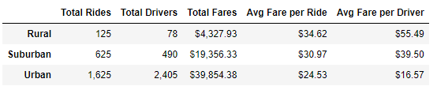
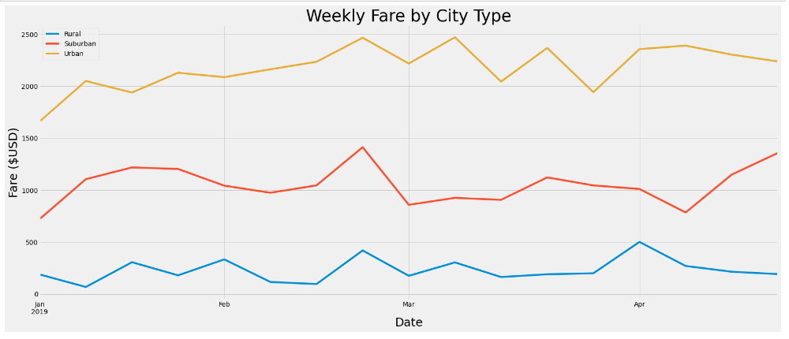

# PyBer_Analysis

## Overview of the Analysis
Assist PyBer in visualizing the weekly fare by city type in the 1st quarter of 2019. We used Pandas & Matplotlib to create a DataFrame & multiple-line chart for analysis out of the city and ride CSV files provided by PyBer.

## Results

### PyBer Summary DataFrame

- Rural
  - Lowest number of rides (125) and drivers (78)
  - Highest average fare per ride ($34.62) and average fare per driver ($55.49)
- Urban
  - Most rides (1,625) and drivers (2,405)
  - Lowest average fare per ride ($24.53) and average fare per driver ($16.57)
  - Urban data may be skewed since there are more drivers than rides, lowering average fare per driver data.
- Suburban
  - Ride, driver, and fare data all fell between Rural & Urban data.

### PyBer's Weekly Fare by City Type | 1st Quarter of 2019

- Urban and Suburban fares increased overall from January 2019 - April 2019.
- Rural fares stayed fairly steady throughout the 1st quarter of 2019.
- Fares in each city type increased in late February. 
- Throughout the 1st quarter of 2019, Urban fare totals were the highest, suburban fare totals next highest, and rural fare totals were the lowest.

## Summary & Recommendations
The CEO should continue to analyze the ratio of drivers to rides in each of these city types. Analysis of the 1st quarter of 2019 for PyBer leads us to recommend the following:
- There are too many drivers in urban cities, incentivize urban drivers to pick up suburban and rural riders through bonus programs.
- There is a small shortage of suburban and rural drivers, market to those areas to find new drivers and/or market to urban drivers about the opportunity.
- Increase rider demand in urban cities by lowering prices, in an attempt to lower the surplus of urban drivers that are unable to find rides.
  - Sacrifice some margin for a healthier balance between supply and demand.